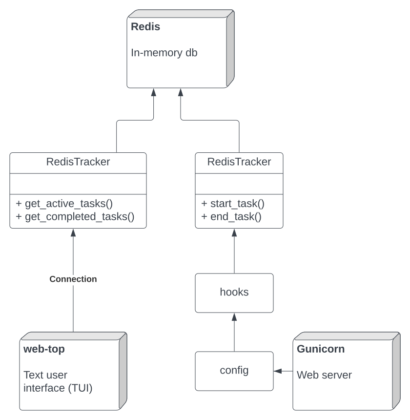

How to integrate your web server
================================

You need to have a database that tracks

- Currently active HTTP request

- Completed HTTP requests, in a ring buffer

Some web servers can do this as a in-memory storage,
but for example for :ref:`Gunicorn`, due to use of multiple processes
threads and green threads this is quite difficult. Thus,
sometimes it is much easier to outsource the task for something
like :ref:`redis`.

There are two models of doing tracking

- Push tracking: a web server notifies tracker when a request is starte for stopped

- Pull tracking: a web server maintains a JSON HTTP GET endpoint that gives the list of current
  and past requests

Below is an example how tracker is managed on :ref:`Gunicorn` web server using push model:

