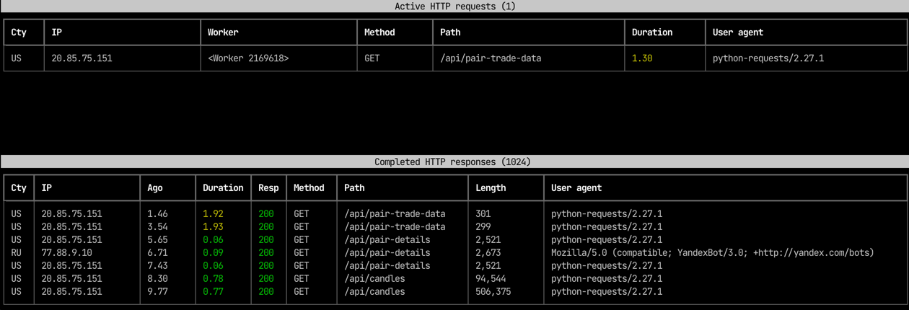

web-top
=======

web-top is a UNIX top-like tool to live HTTP requests and responses of any web server.

.. toctree::
   :maxdepth: 2
   :caption: Contents:

   about
   usage
   integrations
   how-to-integrate
   gunicorn
   demo